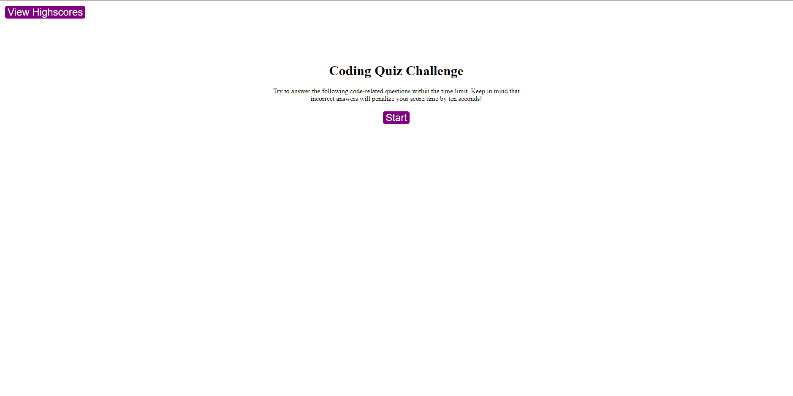
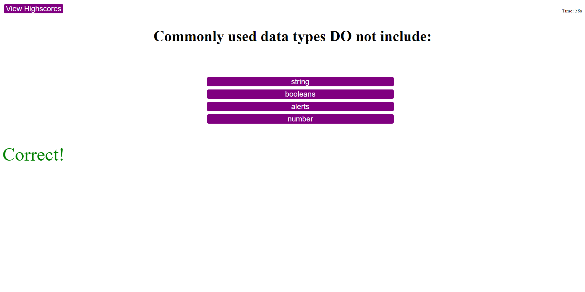
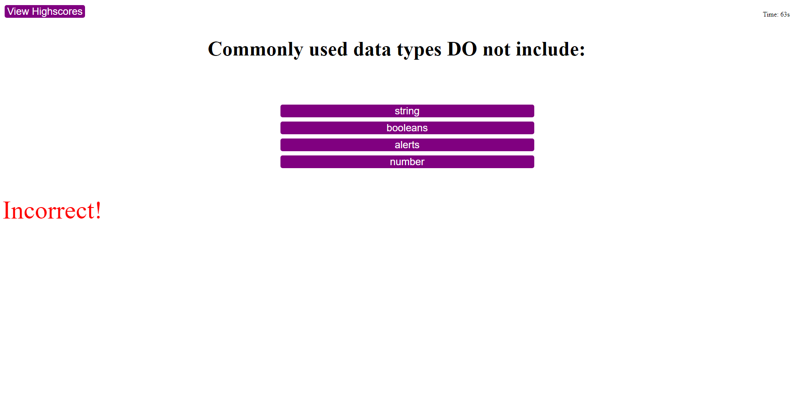

# Interview-Quiz
## Description

    I was tasked to make a mockup interview quiz to test myself and my peers. The purpose of this was so that I could practice more advanced JavaScript skills and I can build an idea of how some interviews would be.

## Installation
   On the first day, I primarily worked on setting up the repository and the HTML code. HTML, I added class tags buttons, and text for each section of the page, start page, question scoreboard, etc, On the second day I worked on all the JavaScript, and CSS, and debugged/linked all the CSS and JS. For the CSS the main thing was having certain code hidden till said otherwise by the JavaScript. Other than that installation it was used to make the webpage look nice and clean in addition to having the buttons look proper. After that, I started the JavaScript process. To start with I made it so that each time you clicked a button a different part of the page would appear for example, if you press start the start page would become hidden and the question screen would appear. Next, I created the questions which are at the top of the JavaScript. Thanks to my classmate telling me to put it in an object it saved me a lot of time from writing if, else statements. Lastly, I set up the timer on the exam and scoreboard.

## Challenges
    For the most part, I faced a lot of Challenges with JavaScript since it was my least experienced language. The most difficult part was setting the scoreboard and the timer. For the score board I was running into a bug that would not make it visible it took hours to find out and the problem was a typo because I put it within my submit section. For the timer, there was this bug in which if you got something wrong the timer would go down but go back up as if you never got it wrong which I was eventually able to fix because of the Xpert Learning Assistant after a lot of trial and error with the A.I.

## Usage

    The purpose of the website is to quiz yourself on JavaScript concepts so that it helps with your own JavaScript knowledge and to help with interviews as in some interviews the kinds of questions are likely to appear. 

## Credits

w3schools,
Xpert Learning Assistant, 
https://www.javatpoint.com/javascript-mcq,
https://www.interviewbit.com/javascript-mcq/,
Youtube,
Reddit,
Stack Overflow,
Classmates,

## Website 
https://unevailable.github.io/Interview-Quiz/

## License

MIT License

Copyright (c) 2023 Unevailable

Permission is hereby granted, free of charge, to any person obtaining a copy
of this software and associated documentation files (the "Software"), to deal
in the Software without restriction, including without limitation the rights
to use, copy, modify, merge, publish, distribute, sublicense, and/or sell
copies of the Software, and to permit persons to whom the Software is
furnished to do so, subject to the following conditions:

The above copyright notice and this permission notice shall be included in all
copies or substantial portions of the Software.

THE SOFTWARE IS PROVIDED "AS IS", WITHOUT WARRANTY OF ANY KIND, EXPRESS OR
IMPLIED, INCLUDING BUT NOT LIMITED TO THE WARRANTIES OF MERCHANTABILITY,
FITNESS FOR A PARTICULAR PURPOSE AND NONINFRINGEMENT. IN NO EVENT SHALL THE
AUTHORS OR COPYRIGHT HOLDERS BE LIABLE FOR ANY CLAIM, DAMAGES OR OTHER
LIABILITY, WHETHER IN AN ACTION OF CONTRACT, TORT OR OTHERWISE, ARISING FROM,
OUT OF OR IN CONNECTION WITH THE SOFTWARE OR THE USE OR OTHER DEALINGS IN THE
SOFTWARE.
